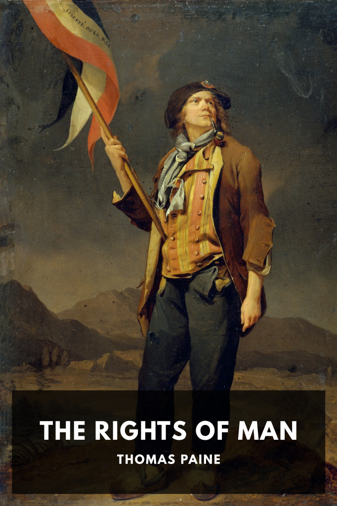

# The Rights of Man <kbd>v3.2.1</kbd>

  

## Creator
Thomas Paine

## Description
A philosopher and political activist presents a forceful argument in favor of the principles of the French Revolution and of republicanism in general, together with a condemnation of monarchy and hereditary power in general.
