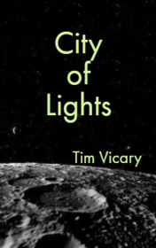

# City of Lights <kbd>v3.3.1</kbd>

  

## Creator
Tim Vicary

## Description
A young pilot Cathy Fox has lost her job. She is said to be seriously ill. But Cathy tells a completely different story. Last year she flew a space-plane called 'Space Bird One'. Two other girls accompanied her. Helen was another astronaut and Mary was a journalist. The trip was very important and it was broadcast all over the world. The flight was going well until the girls saw a strange object. Mary wanted to discuss it on the TV, but the other girls did not let her. As the space-plane tried to move away from the object, the motors suddenly broke down. The plane went out of the Earth's orbit at the risk of never coming back. Fortunately, the pilots found a way out. What the girls saw on the dark side of the Moon changed their lives forever.
