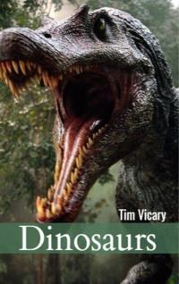

# Dinosaurs <kbd>v3.3.1</kbd>

  

## Creator
Tim Vicary

## Description
Despite the constant development of science, we know very little about dinosaurs. New information reveals little by little. Mankind knows a lot. Still there are more questions than answers. Serious mistakes were made in the study of prehistoric reptiles. Perhaps even today we imagine the appearance of dinosaurs not entirely true. There is an interesting historic fact. In the mid-nineteenth century, Richard Owen organized dinner for twenty respected people. The table was inside a model of the skeleton of an iguanodon. The model was not assembled correctly. The researchers thought that part was a horn. But it was just a finger. In this book you can read what humanity knows about dinosaurs today. 
