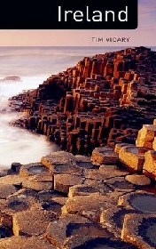

# Ireland <kbd>v3.2.1</kbd>

  

## Creator
Tim Vicary

## Description
This book will introduce Ireland to you. This country is incredibly beautiful. There are many mountains and rivers. One can see emerald greenery there. Certainly, you have heard that the Irish are the most drinking people in Europe. That they are the descendants of the redheaded Celts. You have also heard about the Irish step and the pubs. There are lots of famous Irishmen. The book contains an overview on geography, sport, history, religion, language, music, dance and wars. It includes the descriptions of the most significant cities. The material is presented in a fascinating form as an experienced teacher created this book. The author teaches the course on 'Northern Ireland' at the university. This writer is famous not only for writing historical novels but also for criminal ones. His books are very popular among the English learners.
