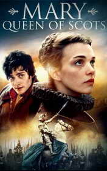

# Mary, Queen of Scots <kbd>v3.3.1</kbd>

  

## Creator
Tim Vicary

## Description
Maria Stewart, the nee Queen of Scotland, experienced many events in her life. Each of them directly affected lives of her citizens and the whole country. Maria Stuart had been the queen of Scotland since infancy. Being the wife of Francis II, she ruled France for one year. She also claimed the English throne. The daughter of King James and the French princess, Maria, barely born, lost her father. She remained the only heiress of the monarch. The closest relative of Maria James Hamilton became the regent of the country. Later he insisted on the marriage between the young queen and Edward, the son of King Henry VIII of England. Maria Stuart went through many ordeals. She faced political intrigues. She also met her love. You can read her last letter. It tells how this fragile but strong woman coped with everything. The queen wrote this letter to her son for him to learn the truth about his mother.
