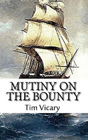

# Mutiny on the Bounty <kbd>v3.3.1</kbd>

  

## Creator
Tim Vicary

## Description
What is honor and dignity for an officer? Perhaps it is the most important thing that he must cherish no matter what. In 1787 ship Bounty departs from the coast of England. Officer Christian Fletcher, a young fourteen-year-old assistant officer Peter Heywood, sailor John Adams and captain William Bligh are on the deck, parting with the shores of the homeland. The men are encouraged by the future journey, as they have to visit Tahiti. But they do not even guess what adventures are to happen to them. Not all of them will see their beloved England again. The ship has 33 sailors and 11 officers. The captain is very concerned as it is his first ship. He cares about the sailors but not about his assistant officers, to whom his demands are clearly overstated. The captain's right hand and best friend in the past Christian suffers most form this demanding leadership. A year later, the ship leaves the coast of Tahiti. Christian decides to escape. Sailor John Adams stops him and proposes to solve the problem with the intolerable captain.
