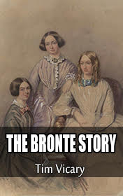

# The Bronte Story <kbd>v3.3.1</kbd>

  

## Creator
Tim Vicary

## Description
This book is about the greatest English writers-sisters of the 19th century, whose novels were a sensation. Their books were admitted as the classic English literature. How do people get their talents? Some think that it is a gift from God. Other think that people are born with it. Somebody says that a talent can be developed due to hard work. Or it is simply a good luck. The Brontë family got an unordinary talent. They did not have any special education in this area, but still they achieved a huge success. But fate was not benevolent to them. Their lives were short and hard. Poverty made the sisters work since childhood. The diseases took them away one by one. The writers left immortal works. The biography of famous sisters Charlotte, Emily and Ann has a significant mark in the literature.
