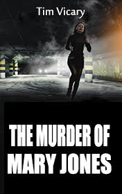

# The Murder of Mary Jones <kbd>v3.3.1</kbd>

  

## Creator
Tim Vicary

## Description
The courtroom is full of people. Everybody gathered for the sake of today's court case. Two young men Dan Smith and Simon Clark get up from the dock. The clerk strictly looks at them and asks: 'Who killed Mary Jones?' They said: 'We are not guilty. We did not do it.' But this can be a lie. There is a possibility these young men are real killers. The police officers found a murder weapon in the stolen car. Later they found some traces of blood on Simon's head. If the jury decides they are guilty тАУ Dan and Simon will be sentenced to prison up to a lot of years. Will the lawyers be  able save young people and find out the truth? Each present man in that building also wants to know about the murder of that poor woman. The reader can learn everything too.
