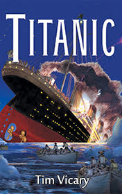

# Titanic <kbd>v3.3.1</kbd>

  

## Creator
Tim Vicary

## Description
In April 1912 a new British ship set sail for the first time. Her name was Titanic. She was big, fast and beautiful. The naval architects were very proud. They said the Titanic was the safest ship in the world. She was unsinkable. The passengers felt happy. Some of them enjoyed the luxury of the Titanic, others hoped to get to America and start a new life there. But their excitement was not to last long. Just in several days the Titanic hit an iceberg and sank to the bottom of the ocean. The tragedy took over 1,500 lives. People still wonder how this could happen to seemingly the safest ship in the world. This book is an attempt to give a detailed description of the disaster. It introduces us to the real passengers and crew members of the Titanic telling their stories and allowing us to go through the terror of that historic night.
