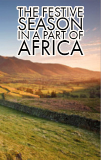

# The Festive Season in a Part of Africa <kbd>v3.3.1</kbd>

  

## Creator
Tod Collins

## Description
A poor African farmer has a very hard life. She has only one thin cow and is obliged to ensure that the cow is not ill and feels good. If it gets sick, she will have to call a vet for it. This will cost a lot of money. But the farmer still will have to call a vet, because the death of this cow will be a huge tragedy for a poor person. A few days after Christmas, the vet goes to the next call. The woman and her son are waiting for the doctor: their cow was to give birth to a calf two days ago, but this did not happen. So the doctor and the woman are driving along the broken roads to reach the farm on the outskirts of the town. They barely arrive at their destination place and get out of the car. Five minutes later, they walk out to the neat white house. 
