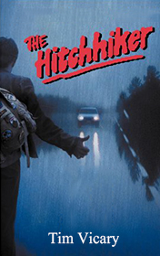

# The Hitch Hiker <kbd>v3.2.1</kbd>

  

## Creator
Vicary Tim

## Description

A man was standing on the road and waiting for somebody to pick him up. He did not look like a usual hitchhiker, so Sue Fraser decided to give him a lift. Usually she does not pick up anybody, but today she stopped. There was something very strange about his appearance and behavior. While they were going, they saw a huge car crash. Sue worked in the police and she had to help. A driver, who was the cause of the accident, explained to her everything. A man had run to the road and the driver had to stop. A car behind hit him and the driver with his daughter were injured. The culprit said he had shot down a man. But the police didn't find the body. They thought the driver was crazy or his head was very injured. However, twenty years ago there was the same situation on that place.

