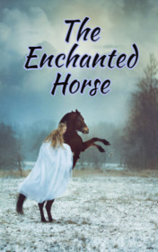

# The Enchanted Horse <kbd>v3.2.1</kbd>

  

## Creator
Victoria Bradshaw

## Description
It was New Year in the city of Shiraz, Persia. Lots of people came to the central square. The king and his family were also present. There was music around and people were dancing. There were snake charmers, jugglers, a variety of drinks and delicious food. Suddenly a man with a beautiful ebony horse approached the king. He told the king that it was an unusual horse. If you pressed a button on its neck, this horse would be able to fly and bring the passenger to any place. The king got interested. He wanted to get such a magical horse. The man agreed to present it if the king allowed him to marry the princess. First the monarch ordered his son to test this horse. The prince pressed the button on its neck and disappeared in the clouds.
