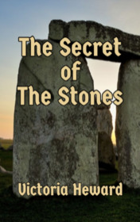

# The Secret of the Stones <kbd>v3.3.1</kbd>

  

## Creator
Victoria Heward

## Description
Max and Lara are brother and a sister. They are twins. The children spend another summer in a small picturesque village, not far from Stonehenge. First it seems too much boring - the nearest city is far from there, there are only forests, fields and clear air. Absolutely nothing to do! But still the curious twins will not be bored, because there's a lot of interesting things to discover around. They find an ancient mysterious symbol and a book full of ciphers and secrets. Their uncle is not who they thought he was. Max and Lara  boldly take up the investigation, like real professional detectives. Soon, these two brave teenagers are involved in some exciting adventures. What will their search lead to? Is it enough just one summer to reveal all the secrets?
