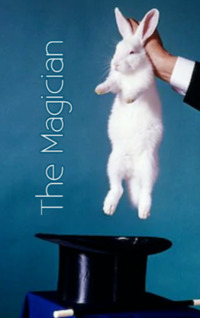

# The Magician <kbd>v3.2.1</kbd>

  

## Creator
W. Somerset Maugham

## Description
A gentleman named Oliver Haddo is in the center of the plot. This man devotes his life not to a banal profession, but to the study of magic and black arts. Oliver is sure that he possesses outstanding magical abilities and does not doubt the existence of magic. Still such behaviour looks strange in England of this period. People around doubt sanity of Mr. Haddo. Oliver falls in love with the wife of a young surgeon Arthur. Arthur and Margaret are progressive people. They believe exclusively in science. Magic is just a superstition for them. But Oliver is not satisfied with such views. He is going to ask dark magic for help. He will prove to Margaret that he is worth her attention. What will win in the end? Progress or ancient dark beliefs? 
