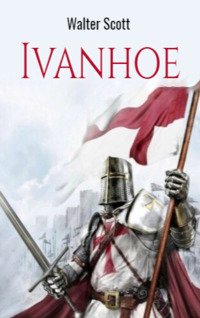

# Ivanhoe <kbd>v3.2.1</kbd>

  

## Creator
Walter Scott

## Description
The novel 'Ivanhoe' catches attention from the first page. It tells about brave knights and beautiful ladies, villains and battles. The Third Crusade ended. All the knights returned home. King Richard the Lionheart was taken prisoner. Prince John was on the throne illegally. All the noble people of England came to Ashby for the knight tournament. Cedric the Saxon, Lady Rowena and their servants also arrived in Ashby. The tournament was exciting. Some knight 'Desdichado' took part in it. He turned out to be the son of Cedric. Long ago, Cedric disinherited his son Ivanhoe and kicked him out of the house. It was because of Ivanhoe's love for Rowena.But Ivanhoe returned to get his rights back and marry his lady. But he was not the only one who wanted to be with Lady Rowena.     
