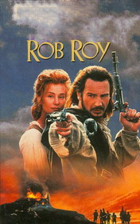

# Rob Roy <kbd>v3.2.1</kbd>

  

## Creator
Walter Scott

## Description

The novel will give you deep understanding of complicated pictures of Scotland and English community relationships of the 18th century. The actions developed quite fast. The main hero was called to his fathers business from Bordo. There, in London, Francis found, that his father wanted to give him the commerce business. But he had no desire to know the commerce secrets, he was a man of art, liked writing, poems, reading literature. His father got angry when he found out it and in punishment he sent Francis to visit relatives. In North England he met his lazy drinkers cousins and clever, interesting girl Diana. The life in castle brought Francis some adventures and personal growth.

