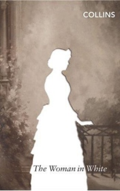

# Woman in white <kbd>v3.3.1</kbd>

  

## Creator
Wilkie Collins

## Description
The young painter Walter Hartright has got a job like a drawing teacher in the  Limmeridge. He was recommended at this position by an Italian professor Pesca, his good friend. Walter was living in London, so he has to leave his town and went to Cumberland for this work. He decided to   say goodbye with his mother and sister. When he went out he met a strange woman. She was dressed in white from head to foot. They continued their way together and were talking. The woman in white has excited when he told about his future work, about people had hired him. And she has been telling about these people with love, anger and fear. Then Walter helped her to catch the cab and almost right he met two men who were searching woman in white which had escaped from the asylum.
