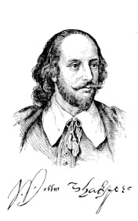

# Shakespeare - His Life and Plays <kbd>v3.2.1</kbd>

  

## Creator
Will Fowler

## Description

Everybody knows the name of the greatest English writer all the times, everybody cried when reads his dramas or laughs at comedies, everyone's heart were touched by his words. But who was William Shakespeare indeed, and what do we know about him? A lot of different information and myths you could read about this person and this book could help you to sort it and find out the truth. A lifetime adventure expecting you on these pages, from Shakespeare's birth to his death. Phenomenal writer left us an immortal legacy. But what had influenced of his development like actor and writer? Who were the prototypes of heroes in his works? It's all about William's career, private life and lot of other interesting facts which you would not find at Wikipedia. Shakespeare in fashion forever.

