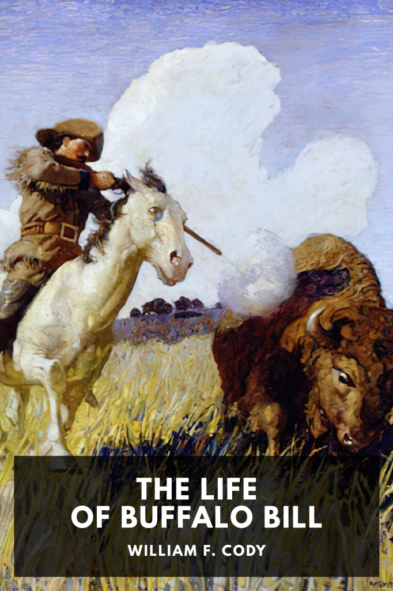

# The Life of Buffalo Bill <kbd>v3.2.1</kbd>

  

## Creator
William F. Cody

## Description
The 1879 autobiography of William F. Cody, more commonly known as Buffalo Bill, detailing his early life in the American West.
