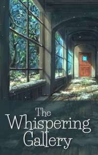

# The Whispering Gallery <kbd>v3.3.1</kbd>

  

## Creator
William F. Temple

## Description
Frederick heard a strange voice in early childhood. Strange, but nobody else heard it. This voice told the child different things. It often talked about one mysterious golden ball. Many years passed. Now Frederick is a wealthy man. He doesn't hear strange voices anymore. One day he is driving in a car with a driver through London. Suddenly, Frederick sees a huge cathedral. This is a breathtaking building. The man asks the driver to stop the car. The reason is that he notices something like a golden ball on the roof of the cathedral. This decoration awakens disturbing memories from childhood. The golden ball becomes the only thing Frederick can think about. Where is the key to this mystery? 
