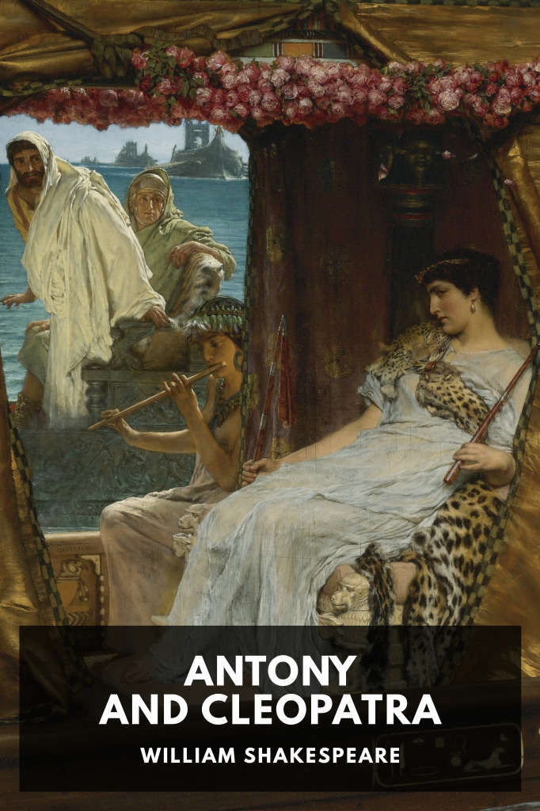

# Antony and Cleopatra <kbd>v3.3.1</kbd>

  

## Creator
William Shakespeare

## Description
Mark Antony, a Roman triumvir, and Cleopatra, the Queen of Egypt, become embroiled in a deadly love affair.
