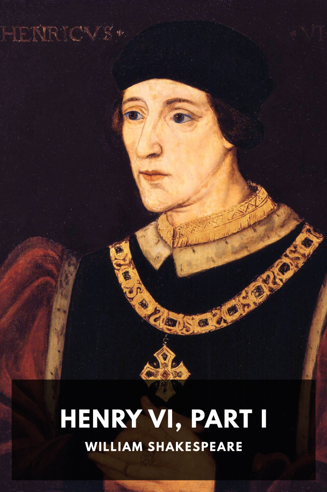

# Henry VI, Part I <kbd>v3.2.1</kbd>

  

## Creator
William Shakespeare

## Description
King Henry VI takes the throne during a time of great political division: the quarreling among English noblemen and the collapse of England’s hold in France.
