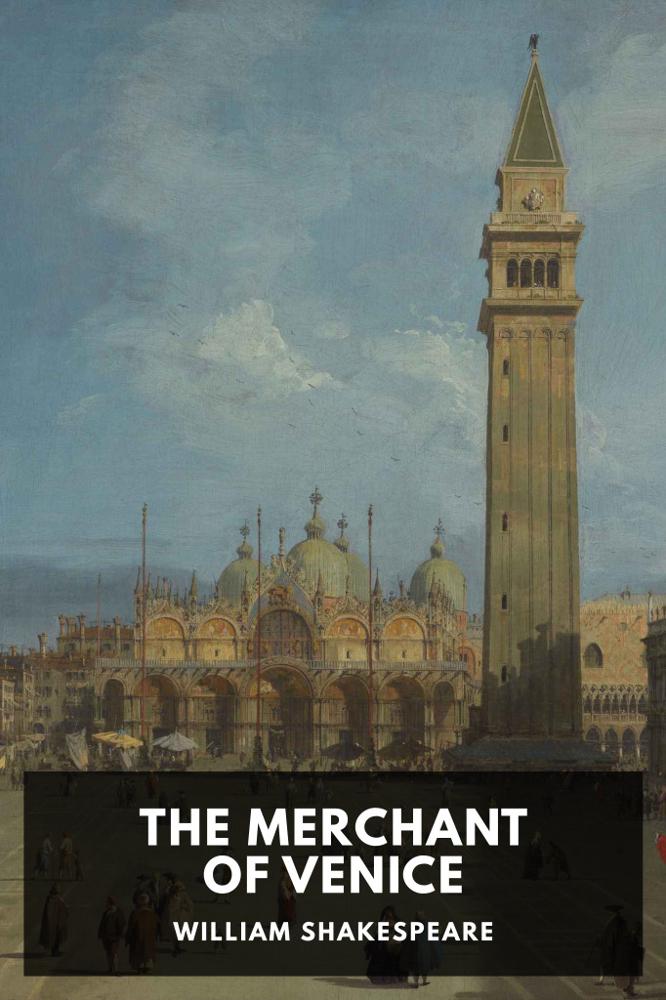

# The Merchant of Venice <kbd>v3.2.1</kbd>

  

## Creator
William Shakespeare

## Description
To help his friend Bassanio woo the beautiful Portia, the Venetian merchant Antonio borrows a large sum from Shylock, a Jewish moneylender.
