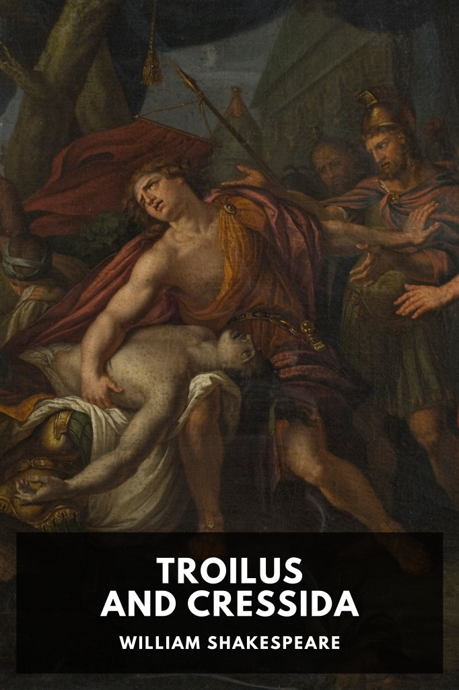

# Troilus and Cressida <kbd>v3.2.1</kbd>

  

## Creator
William Shakespeare

## Description
A Trojan prince falls in love with a woman amid the Trojan War, only to see her exchanged to the Greeks for a prisoner of war.
