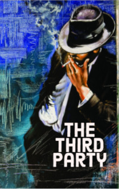

# The Third Party <kbd>v3.3.1</kbd>

  

## Creator
William Trevor

## Description
The law is: a third person is a person who was involved in the situation by the first two people. Often, a third party is necessary for divorce. But there are other situations. And it is not always possible to immediately understand who the third person is. The two men agreed to meet at the bar at noon. One of them said that the other should recognize him. After all, his appearance was already told: he was tall with blond hair, which was just beginning to become grey. The other person was short, slouching, and wore glasses. The second man's name was Lairdman. The tall old man answered to Boland. The old man took out his wallet and offered to pay for the drinks. He took a stack of whiskey for himself and a glass of lemonade for another man. Boland took out a cigarette. Then he started the conversation.
