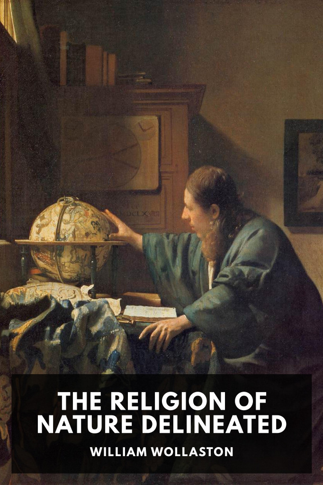

# The Religion of Nature Delineated <kbd>v3.2.1</kbd>

  

## Creator
William Wollaston

## Description
Wollaston attempts to derive ethics and religion by using rational thought and observation of the natural world, without resorting to revelation or received religion.
