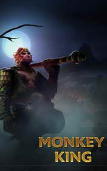

# The Monkey King <kbd>v3.3.1</kbd>

  

## Creator
Wu Cheng

## Description
Everything started from the fact that a rock gave birth to an egg. A monkey hatched from it. The future king of monkeys easily found a common language with the monkeys born naturally. After a while, they recognized his superiority and chose him their king. Many years later, the monkey king started worrying about his death. He decided to leave his kingdom and to go into the unknown in search of immortality. At the very beginning of the journey, he studied magic and learned how to transform into various objects. Then he had to kill a demon. Finally, he found the registry of death where he struck out his name and the names of many other monkeys. Gods united and arrested the immortal Monkey King. But the Monkey King didn't lie when he called himself a great and wise king. He managed to escape from the heaven prison.
