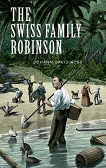

# The Swiss Family Robinson <kbd>v3.2.1</kbd>

  

## Creator
Wyss Johann

## Description
The priest created this book two centuries ago. He wrote this work to educate his own children. The book had to instill the family values and explain to them how to treat land. It taught to be conscious and sympathetic. The story begins with one family. They go out on the voyage. The ship is caught in a storm and the family manages to get to an uninhabitable tropical island. The husband, the wife and four sons survive. What should they do now? How will they make a living? What will they eat? The family makes a temporary camp and starts exploring the island. They are searching for some remaining items from the ship that might be useful to them. The findings will facilitate life on the island. The parents have farming and housekeeping skills. Still the family faces the same problem. How long will they have to stay on the island?
